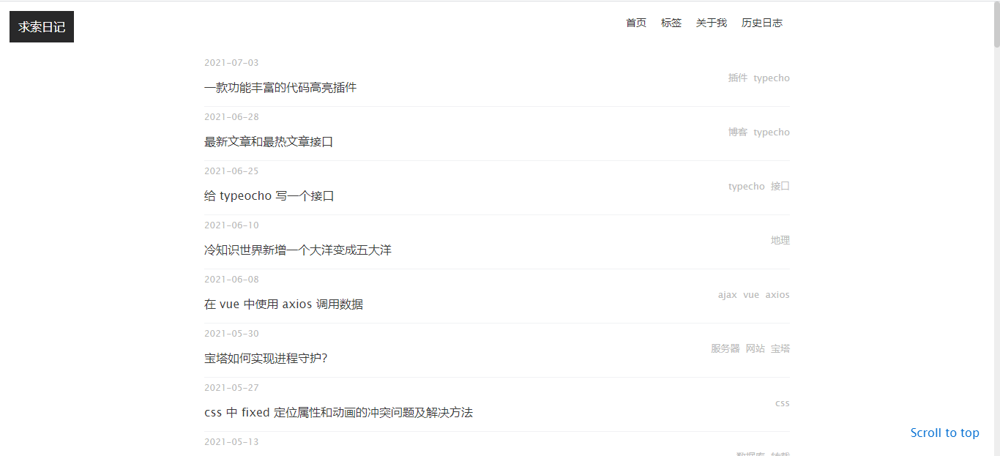
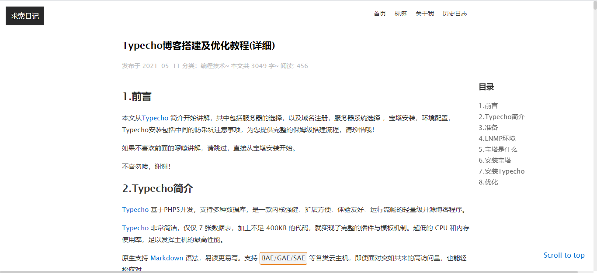
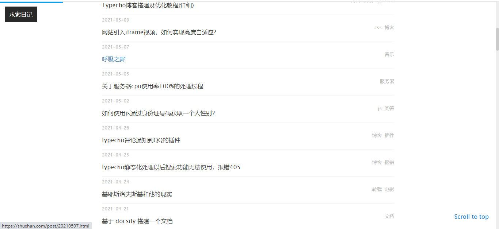

## SimpleZ

SimpleZ 一款基于 typecho 的简约风单栏博客主题，专注于写作，抛弃了一切臃肿的功能，单纯为写作而存在。

占用极小，主要代码不到 200KB，是轻量级博客中的轻量级主题。

在线demo: [https://shuxhan.com](https://shuxhan.com)

## 介绍

其实这是我自用的主题，灵感来自于[余果的博客](https://yuguo.us)，抛弃了60%的字段，保留了最原始的博客文章数据，界面简洁，色系协调。

暂时只写了自己需要的功能，如果后续有朋友提出 issues ，我将会持续更新。

如果对主题感兴趣可以提提 issues！

## 插件

### 1. ContentIndex

为多个标题的文章生成目录。

ps: 下面是专门修改过的插件，专为适配本主题，使用其他插件可能会报错。

下载地址：[https://github.com/shuxhan/SimpleZ-ContentIndex](https://github.com/shuxhan/SimpleZ-ContentIndex)

### 2. ViewsCounter

文章浏览量统计插件，可设置对同一篇文章的多次浏览行为是否计入浏览量的时间间隔。

1. 可以自行在 Github 搜索下载，然后在 post.php 将注释的代码解开
2. 不需要可以忽略

## 图片展示

## LICENSE

[LICENSE](./LICENSE)
